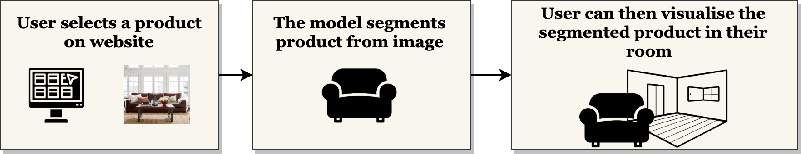

# Image segmentation using Deep Learning for e-commerce applications
The project aimed at using image segmentation for products on e-commerce websites. It involved creating dataset by scraping product images, using transfer learning to fine-tune the pre-trained deep learning model to perform segmentation of products from images. The Model predictions were served using FLASK Webapp, containerised using Docker and deployed on AWS through CI/CD Pipeline.

## Project Overview
The project consisted of the following steps,

* Data Collection: Scraping product images from ecommerce websites
* Data Labelling: Using Detectron2 to obtain labels (masks) for training custom model
* Data Pre-processing: Image resize, Data augmentation, Normalisation
* Model Fitting and Training:
* Building image segmentation model using MobileNet as base model
* Fine-tuning last layer of pre-trained model
* Tuning hyperparameters
* Model Serving: Using FLASK to deploy and serve Model predictions using REST API
* Container: Using Docker to containerise the Web Application
* Production: Using AWS CI/CD Pipeline for continuous integration and deployment.

## Project Resources

  

    <ul>
      <li>The <a href="http://ec2-65-0-106-104.ap-south-1.compute.amazonaws.com/">AWS Webapp</a> for this project</li>
      <li>Run this code on </li>
      <li>View Source on <a href="https://github.com/deepak-karkala/product-segmentation-ecommerce">Github</a></li>
      <li>Docker Container for the project: dkarkala01/ecom-prod-seg-app</li>
    </ul>
  

## Project Objective

  

    

      <b>The Problem: </b>One of the major factor that holds people back while shopping online for furniture and home decor products is that they won't be able to touch, see in person and feel how the product would fit into their home. The user has to go solely by the images of products posted on the ecommerce websites. This makes the user more hesitant while shopping online for such products.
    

    

      <b>The Solution: </b>The project aims to address this issue by providing an option for the user to segment the product from the image       and then visualise how it fits in their own home. This is done by using an Image Segmentation Model which can separate the predefined set of product                  categories from the rest of the image, which can then be placed on a video stream of the user's room for visualisation. 
    

  

  

    
  

