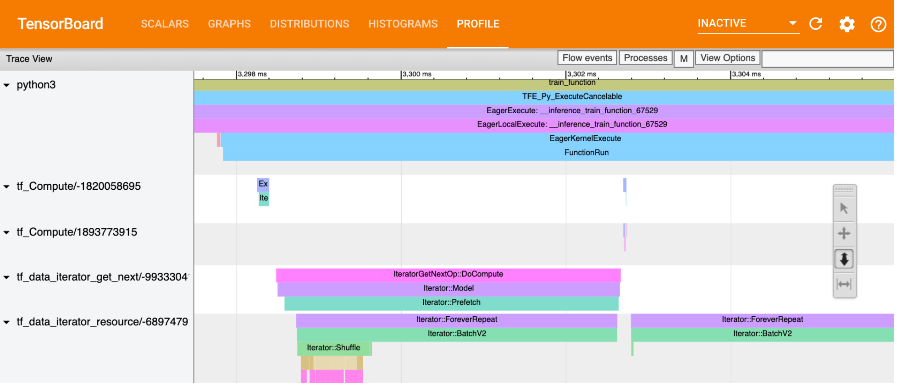

# Image segmentation using Deep Learning for e-commerce applications
The project aimed at using image segmentation for products on e-commerce websites. It involved creating dataset by scraping product images, using transfer learning to fine-tune the pre-trained deep learning model to perform segmentation of products from images. The Model predictions were served using FLASK Webapp, containerised using Docker and deployed on AWS through CI/CD Pipeline.


## Project Overview
The project consisted of the following steps,

* Data Collection: Scraping product images from ecommerce websites
* Data Labelling: Using Detectron2 to obtain labels (masks) for training custom model
* Data Pre-processing: Image resize, Data augmentation, Normalisation
* Model Fitting and Training:
* Building image segmentation model using MobileNet as base model
* Fine-tuning last layer of pre-trained model
* Tuning hyperparameters
* Model Serving: Using FLASK to deploy and serve Model predictions using REST API
* Container: Using Docker to containerise the Web Application
* Production: Using AWS CI/CD Pipeline for continuous integration and deployment.

<div class="row image_row">
  <div class="col-lg-6 col-md-10 col-sm-10 col-12 mx-auto">
    
  </div>
</div>

## Project Setup
### Project Resources
<div class="row">
  <div class="col-lg-8 col-md-10 col-sm-10 col-12 mx-auto">
    <ul>
      <li>The <a href="http://ec2-65-0-106-104.ap-south-1.compute.amazonaws.com/">AWS Webapp</a> for this project</li>
      <li>View Project <a href="http://deepakkarkala.com/docs/articles/machine_learning/ecommerce_image_segmentation/about/index.html">Report</a></li>
      <li>Run this code on <a href="https://colab.research.google.com/drive/1snDybPVSYFC2swpiexTW5_F6Prv_fQ_F?usp=sharing">Google Colab</a></li>
      <li>View Source on <a href="https://github.com/deepak-karkala/product-segmentation-ecommerce">Github</a></li>
      <li>Docker Container for the project: dkarkala01/ecom-prod-seg-app</li>
    </ul>
  </div>
</div>

### Project Objective
<div class="row">
  <div class="col-lg-8 col-md-10 col-sm-10 col-12 mx-auto">
    <p class="p_no_top_gap">
      <b>The Problem: </b>One of the major factor that holds people back while shopping online for furniture and home decor products is that they won't be able to touch, see in person and feel how the product would fit into their home. The user has to go solely by the images of products posted on the ecommerce websites. This makes the user more hesitant while shopping online for such products.
    </p>
    <p class="p_no_top_gap">
      <b>The Solution: </b>The project aims to address this issue by providing an option for the user to segment the product from the image       and then visualise how it fits in their own home. This is done by using an Image Segmentation Model which can separate the predefined set of product                  categories from the rest of the image, which can then be placed on a video stream of the user's room for visualisation. 
    </p>
  </div>
</div>

<div class="row image_row">
  <div class="col-lg-6 col-md-10 col-sm-10 col-12 mx-auto">
    
  </div>
</div>


### Project Challenges and constraints
<div class="row">
  <div class="col-lg-8 col-md-10 col-sm-10 col-12 mx-auto">
    <p class="p_no_top_gap">
      <ul>
        <li><b>Limited Data Availability</b>: One of the major challenges that most enterprises face while planning to adopt Machine Learning into their system is the lack of availability of massive datasets necessary to train powerful Models. While in this project, although more data could have been acquired by scraping more product images, this is avoided in order to be constrained to work with a very limited dataset. Will this small dataset be enough to get satisfactory performance is one of the questions to be answered through this project.</li>
        <li><b>Non-resuability of pre-trained models</b>: While there are already many pre-trained Image Segmentation Models which can be used for this purpose, there are two major challenges,
          <ul>
            <li><b>Custom classes</b>: Most pre-trained models would be trained on standard datasets such as MS-COCO, PASCAL-VOC whereas for our application there is a need to segment product categories which are not part of those datasets. As a result, a custom model will need to be built on top of the pre-trained model and the final layers of this model will then have to be trained using custom dataset.</li>
            <li><b>Model evaluation time</b>: The pre-trained models are often massive in size since they have been trained to classify a wide variety of objects. Due to this, such models are slow in nature. However one of the challenges in this application is to have really fast response time such that user can view the segmented product in real-time.</li>
          </ul>
          As a result of this, such pre-trained models cannot be used for this application, instead a custom model which can perform image segmentation on custom product categories with very small size and evaluation time will need to be developed which forms the goal of this project.
        </li>
      </ul>
    </p>
  </div>
</div>


### End Result
<div class="row">
  <div class="col-lg-8 col-md-10 col-sm-10 col-12 mx-auto">
    <p class="p_no_top_gap">
      The end result of this project is shown below. The screen capture (from the app deployed on AWS) shows an example use case of the user selecting a product on a typical ecommerce website, the Image segmentation model returning the segmented product after which the user can then adjust the size and position of the product placed on the video stream of user's room.
    </p>
  </div>
</div>
<div class="row image_row">
  <div class="col-lg-6 col-md-10 col-sm-10 col-12 mx-auto">
    
  </div>
</div>


### Project Considerations
<div class="row">
  <div class="col-lg-8 col-md-10 col-sm-10 col-12 mx-auto">
    <p class="p_no_top_gap">
      Before deciding to use Machine Learning in any application, there are a number of factors to be considered such as what business purpose does the project serve, project constraints, performance constraints, how to evaluate the system performance. The following block diagram describes all the major considerations.
    </p>
  </div>
</div>

<div class="row image_row">
  <div class="col-lg-6 col-md-10 col-sm-10 col-12 mx-auto">
    
  </div>
</div>

## Data Considerations and Pipeline

### Data Considerations
<div class="row">
  <div class="col-lg-8 col-md-10 col-sm-10 col-12 mx-auto">
    <p class="p_no_top_gap">
      One of the major challenges in a Machine Learning project is to handle the various parts of the Data Pipeline such as <em>Data Collection</em>, <em>Data Storage</em>, <em> Data Pre-processing and Representation</em>, <em>Data Privacy</em>, <em>Bias in Data</em>. It is important to handle these aspects of Data pipeline and the following block-diagram answers all the questions regarding handling data.
    </p>
  </div>
</div>

<div class="row image_row">
  <div class="col-lg-6 col-md-10 col-sm-10 col-12 mx-auto">
    
  </div>
</div>

### Data Pipeline
<div class="row">
  <div class="col-lg-8 col-md-10 col-sm-10 col-12 mx-auto">
    <p class="p_no_top_gap">
      After scraping for product images and obtaining reference masks using pre-trained model, the data is stored in a JSON file (paths to images and masks). Pre-processing is then performed on this dataset after which the dataset is divided into 3 sets,
    </p>
    <table class="table table-sm table-bordered">
      <thead>
        <tr>
          <th scope="col">Data</th>
          <th scope="col">Purpose</th>
          <th scope="col">Number of Images</th>
        </tr>
      </thead>
      <tbody>
        <tr>
          <th scope="row">Training</th>
          <td>To fit Model</td>
          <td>285</td>
        </tr>
        <tr>
          <th scope="row">Validation</th>
          <td>To tune hyperparameters</td>
          <td>95</td>
        </tr>
        <tr>
          <th scope="row">Test</th>
          <td>To evaluate model performance</td>
          <td>95</td>
        </tr>
      </tbody>
    </table>
    <p class="p_no_top_gap">
      As can be observed, this is a very small dataset which is to be used to fine-tune the final layers of a pre-trained Image Segmentation Model.
    </p>
  </div>
</div>
<div class="row image_row">
  <div class="col-lg-4 col-md-10 col-sm-10 col-12 mx-auto">
    
  </div>
</div>


## Modeling: Fitting and Training Deep learning models

<div class="row">
  <div class="col-lg-8 col-md-10 col-sm-10 col-12 mx-auto" id="metrics">
    <h3 class="sub-title">Model Evaluation Metrics</h3>
  </div>
</div>


<div class="row">
  <div class="col-lg-8 col-md-10 col-sm-10 col-12 mx-auto">
    <p class="p_no_top_gap">
      The two metrics often used for Image segmentation tasks are 
      <ul>
        <li><b>Pixel wise Classification Accuracy</b>: In this metric, each pixel is regarded as belonging to a class (background or one of the product categories), </li>
        <li><b>Intersection Over Union (IoU)</b>: As described in <a href="https://www.tensorflow.org/api_docs/python/tf/keras/metrics/MeanIoU">Tensorflow documentation</a>, IoU is defined as, IoU = true_positive / (true_positive + false_positive + false_negative).</li>
      </ul>
      In this project, during fitting the model, both the metrics are tracked to see the progress in model training. The second metric, IoU is used to compare model performance on Test dataset.
    </p>
  </div>
</div>

<div class="row">
  <div class="col-lg-8 col-md-10 col-sm-10 col-12 mx-auto" id="baseline">
    <h3 class="sub-title">Baseline Models for Model Comparison</h3>
  </div>
</div>

<div class="row">
  <div class="col-lg-8 col-md-10 col-sm-10 col-12 mx-auto">
    <p class="p_no_top_gap">
      The following are some of the popular Image Segmentation Models. There are two constraints due to which these models cannot be used in this application.
      <ul>
        <li>These models would have been trained on standard datasets and are not capable of performing segmentation on custom product categories used in this application.</li>
        <li>The Model size and evaluation time do not fit the project specifications. In order to be used in a ecommerce website, the model size needs to be small and the evaluation time needs to be very low which would enable an user to view the segmented product instantly.</li>
      </ul>
    </p>
  </div>
</div>

<div class="row">
  <div class="col-lg-8 col-md-10 col-sm-10 col-12 mx-auto">
    <table class="table table-sm table-bordered">
      <thead>
        <tr>
          <th scope="col">Model</th>
          <th scope="col">Size (in MB)</th>
          <th scope="col">Evaluation Time</th>
          <th scope="col">IoU</th>
        </tr>
      </thead>
      <tbody>
        <tr>
          <th scope="row">Detectron 2</th>
          <td>178 MB</td>
          <td>0.10 seconds</td>
          <td>0.89</td>
        </tr>
        <tr>
          <th scope="row">Mask RCNN</th>
          <td>170 MB</td>
          <td>6.29 seconds</td>
          <td>0.66</td>
        </tr>
      </tbody>
    </table>
  </div>
</div>

<div class="row">
  <div class="col-lg-8 col-md-10 col-sm-10 col-12 mx-auto">
    <p class="p_no_top_gap">
      The goal of this project is to build such a custom model which can serve two purposes sepcifically,
      <ul>
        <li>Able to perform Image segmentation on custom product categories</li>
        <li>The Model should be small in size with very low evaluation time per image.</li>
      </ul>
      The following sections will describe the building, training and evaluation of such a custom model. 
    </p>
  </div>
</div>


<div class="row">
  <div class="col-lg-8 col-md-10 col-sm-10 col-12 mx-auto" id="transfer_learning">
    <h3 class="sub-title">Transfer Learning: Fine-tuning pre-trained model</h3>
  </div>
</div>
<div class="row">
  <div class="col-lg-8 col-md-10 col-sm-10 col-12 mx-auto">
    <p class="p_no_top_gap">
      Although a new custom model is necessary for this application, there is no need for this custom model to be built from scratch. Instead a pre-trained model (trained on massive image datasets such as ImageNet) can be used as a base for the custom model. On top of this base model, additional layers can be added. During training, the weights and bias of the base model are fixed and not changed whereas the final layers which are added will be updated. This process is referred to as <b>Transfer Learning</b> where in only the last few layers are trained. After which, all the layers of the custom model can be trained with a small learning rate. This is referred to as <b>Fine-tuning</b> a pre-trained model. 
    </p>
    <p>The code block to build such a model is shown here,</p>
  </div>
</div>

```
from tensorflow_examples.models.pix2pix import pix2pix

def build_model():
    LABEL_NAMES = np.asarray([
        'background', 'couch', 'chair', 'bed', 'vase', 'bowl', 'cup',
        'wine-glass', 'potted-plant'
    ])

    # Each pixel classified into one of OUTPUT_CHANNELS classes
    OUTPUT_CHANNELS = len(LABEL_NAMES) #3

    # Model
    # Base model (for feature extraction)
    base_model = tf.keras.applications.MobileNetV2(input_shape=[128, 128, 3],
                                                  include_top=False,
                                                  weights="imagenet")

    # Use the activations of these layers
    layer_names = [
        'block_1_expand_relu',   # 64x64
        'block_3_expand_relu',   # 32x32
        'block_6_expand_relu',   # 16x16
        'block_13_expand_relu',  # 8x8
        'block_16_project',      # 4x4
    ]
    layers = [base_model.get_layer(name).output for name in layer_names]
    # Create the feature extraction model
    down_stack = tf.keras.Model(inputs=base_model.input, outputs=layers)
    down_stack.trainable = False

    # Decoder
    up_stack = [
        pix2pix.upsample(512, 3),  # 4x4 -> 8x8
        pix2pix.upsample(256, 3),  # 8x8 -> 16x16
        pix2pix.upsample(128, 3),  # 16x16 -> 32x32
        pix2pix.upsample(64, 3),   # 32x32 -> 64x64
    ]

  def unet_model(output_channels):
      inputs = tf.keras.layers.Input(shape=[128, 128, 3])
      x = inputs

      # Downsampling through the model
      skips = down_stack(x)
      x = skips[-1]
      skips = reversed(skips[:-1])

      # Upsampling and establishing the skip connections
      for up, skip in zip(up_stack, skips):
        x = up(x)
        concat = tf.keras.layers.Concatenate()
        x = concat([x, skip])

      # This is the last layer of the model
      last = tf.keras.layers.Conv2DTranspose(
          output_channels, 3, strides=2,
          padding='same')  #64x64 -> 128x128

      x = last(x)

      return tf.keras.Model(inputs=inputs, outputs=x)

  model = unet_model(OUTPUT_CHANNELS)
  model.compile(optimizer='adam',
                loss=tf.keras.losses.SparseCategoricalCrossentropy(from_logits=True),
                metrics=['accuracy'])
  
  return model

model = build_model()
```

<div class="row">
  <div class="col-lg-8 col-md-10 col-sm-10 col-12 mx-auto">
    <h3 class="sub-title">Image Segmentation Model: Custom Layers on top of MobileNet Base Model</h3>
  </div>
</div>
<div class="row">
  <div class="col-lg-8 col-md-10 col-sm-10 col-12 mx-auto">
    <p class="p_no_top_gap">
      The Custom Model is built with the following components,
      <ul>
        <li><b>Base Model</b>: MobileNet V2 pre-trained on ImageNet</li>
        <li><b>Custom Layers</b>: Decoder layers of U-Net</li>
      </ul>
      The input image is first passed through downsampling layers of MobileNet and then upsampled (with skip connections) through the decoder layer stack. All the layers of this Custom Model can be seen in the following figure presented here.
    </p>
  </div>
</div>
<div class="row image_row">
  <div class="col-lg-8 col-md-10 col-sm-10 col-12 mx-auto">
    
  </div>
</div>

<div class="row">
  <div class="col-lg-8 col-md-10 col-sm-10 col-12 mx-auto" id="training">
    <h3 class="sub-title">Model Training</h3>
  </div>
</div>
<div class="row">
  <div class="col-lg-8 col-md-10 col-sm-10 col-12 mx-auto">
    <p class="p_no_top_gap">
      Following are the Model parameters,
      <ul>
        <li><b>Model</b>: U-Net (with MobileNet V2 as base model)</li>
        <li><b>Optimiser</b>: Adam</li>
        <li><b>Loss</b>: Sparse Categorical Cross entropy</li>
        <li><b>Metrics</b>: Accuracy (Pixel wise multi class classification)</li>
      </ul>
      The model is trained with the above parameters. The improvements in accuracy and loss as the model trains is shown in the following figures. 
    </p>
  </div>
</div>
<p float="left">
  
   
</p>
<div class="row">
  <div class="col-lg-8 col-md-10 col-sm-10 col-12 mx-auto">
    <p class="p_no_top_gap">
      <b>Learning Curves Observation</b>: Both training and validation accuracy improves over the early epochs and then saturates. However a reasonably significant gap is observed between the two curves even after many epochs. This suggests that perhaps there is still some overfitting in the model and in order to 
    </p>
  </div>
</div>
<div class="row">
  <div class="col-lg-8 col-md-10 col-sm-10 col-12 mx-auto" id="hp_tuning">
    <h3 class="sub-title">Hyperparameter tuning</h3>
  </div>
</div>
<div class="row">
  <div class="col-lg-8 col-md-10 col-sm-10 col-12 mx-auto">
    <p class="p_no_top_gap">
      So far, the model has been trained on one given set of parameters. However in order to find out the best set of parameters, the model will need to be evaluated on several different combinations of parameters. This process is referred to as <b>Hyper-parameter tuning</b>. In order to avoid using the <em>Test Data</em> until final evaluation, a separate split of data known as <em>Validation Dataset</em> will be used in order to evaluate model with different sets of hyper-parameters.
    </p>
    <p>
      Tensorflow makes it easy to perform Hyper-parameter tuning using Tensorboard. Different sets of parameters are pre-defined and the results are logged to Tensorboard, the code for which is shared here,
    </p>
  </div>
</div>

```
# Hyperparameter tuning using Tensorflow and Tensor board

# Testing performance with varioud optimizers
HP_OPTIMIZER = hp.HParam('optimizer', hp.Discrete(['adam', 'sgd', 'rmsprop']))
METRIC_ACCURACY = 'accuracy'
with tf.summary.create_file_writer('logs/hparam_tuning').as_default():
  hp.hparams_config(
    hparams=[HP_OPTIMIZER],
    metrics=[hp.Metric(METRIC_ACCURACY, display_name='Accuracy')],
  )

# Record accuaracy for each combination of hyperparameters
def run(run_dir, hparams):
  with tf.summary.create_file_writer(run_dir).as_default():
    hp.hparams(hparams)  # record the values used in this trial
    accuracy = train_test_model(hparams)
    tf.summary.scalar(METRIC_ACCURACY, accuracy, step=1)

# Fit model with each combination of hyperparameters
def train_test_model(hparams):
  model = build_model()
  model.fit(train_dataset, epochs=EPOCHS,
            steps_per_epoch=STEPS_PER_EPOCH)
  _, accuracy = model.evaluate(val_dataset)
  return accuracy


# Run model with different combinations of hyperparameters
session_num = 0
for optimizer in HP_OPTIMIZER.domain.values:
  hparams = {
      HP_OPTIMIZER: optimizer,
  }
  run_name = "run-%d" % session_num
  print('--- Starting trial: %s' % run_name)
  print({h.name: hparams[h] for h in hparams})
  run('logs/hparam_tuning/' + run_name, hparams)
  session_num += 1
```

<div class="row">
  <div class="col-lg-8 col-md-10 col-sm-10 col-12 mx-auto">
    <p class="p_no_top_gap">
      In this experiment, the performance of the Model is tested with various options for optimiser: <b>Adam</b>, <b>SGD</b> and <b>RMSProp</b>, the results for which on the Tensorboard is presented here,
    </p>
  </div>
</div>
<p float="left">
  
   
</p>
<div class="row">
  <div class="col-lg-8 col-md-10 col-sm-10 col-12 mx-auto" id="profiler">
    <h3 class="sub-title">Tensorflow Profiler</h3>
  </div>
</div>
<div class="row">
  <div class="col-lg-8 col-md-10 col-sm-10 col-12 mx-auto">
    <p class="p_no_top_gap">
      During training, one of the aspects to be monitored is the amount of time it takes to compute the various stages of the data pipeline. Inspecting this will help in identifying the most time intensive section of the pipeline which can then be addressed in order to reduce the total training time.
    </p>
    <p class="p_no_top_gap">
      Tensorflow's Profiler makes it easier to track various metrics such as Time Taken on Host, Time Taken on Device, Time Spent for various operations on GPU, Memory Profile and Performance Summary, the stats for which are presented in the following figures below.
    </p>
  </div>
</div>
<p float="left">
  
   
</p>
<p float="left">
  
   
</p>
<div class="row">
  <div class="col-lg-8 col-md-10 col-sm-10 col-12 mx-auto" id="input_pipeline">
    <h3 class="sub-title">Tensorflow Input Data Pipeline</h3>
  </div>
</div>
<div class="row">
  <div class="col-lg-8 col-md-10 col-sm-10 col-12 mx-auto">
    <p class="p_no_top_gap">
      In order to reduce the time spent in Input Data Pipeline and improve the memory footprint, a number of steps can be adopted as suggested in <a href="https://www.tensorflow.org/guide/data_performance">Tensorflow's Input Data Pipeline Guide</a>. The following operations are used in this project,
      <ul>
        <li><b>Prefetching</b>: Prefetching overlaps the preprocessing and model execution of a training step. While the model is executing training step <em>n</em>, the input pipeline is reading the data for step <em>n+1</em>. Doing so reduces the step time to the maximum (as opposed to the sum) of the training and the time it takes to extract the data.</li>
        <li><b>Parallel mapping</b>: When preparing data, input elements may need to be pre-processed. To this end, the map transformation, which applies a user-defined function to each element of the input dataset is used. Because input elements are independent of one another, the pre-processing can be parallelized across multiple CPU cores.</li>
        <li><b>Caching</b>: Caching a dataset, either in memory or on local storage will save some operations (like file opening and data reading) from being executed during each epoch.</li>
        <li><b>Batching</b>: Invoking a user-defined function passed into the map transformation has overhead related to scheduling and executing the user-defined function. By applying the batch transformation before the map transformation the user-defined function can operate over a batch of inputs at once.</li>
      </ul>
    </p>
  </div>
</div>

```
# Training dataset
train_dataset = tf.data.Dataset.from_tensor_slices((train_images, train_masks))
train_dataset = train_dataset.map(load_image_train)
train_dataset = train_dataset.cache()
train_dataset = train_dataset.shuffle(BUFFER_SIZE)
train_dataset = train_dataset.batch(BATCH_SIZE)
train_dataset = train_dataset.repeat()
train_dataset = train_dataset.prefetch(buffer_size=tf.data.experimental.AUTOTUNE)
```

<div class="row">
  <div class="col-lg-8 col-md-10 col-sm-10 col-12 mx-auto">
    <p class="p_no_top_gap">
      The timeline for various Input Data Pipeline operations as seen in Tensorflow's Trace Viewer is presented here,
    </p>
  </div>
</div>
<div class="row image_row">
  <div class="col-lg-8 col-md-10 col-sm-10 col-12 mx-auto">
    
  </div>
</div>

<div class="row">
  <div class="col-lg-8 col-md-10 col-sm-10 col-12 mx-auto" id="logging">
    <h3 class="sub-title">Logging data to Tensorboard</h3>
  </div>
</div>
<div class="row">
  <div class="col-lg-8 col-md-10 col-sm-10 col-12 mx-auto">
    <p class="p_no_top_gap">
      In addition to the <em>Loss</em> and <em>Accuracy</em> metrics, other custom data can be logged to Tensorboard during Model training. Since this project uses <b>Intersection Over Union (IoU)</b> as one of the performance metrics, the <em>IoU</em> value on the validation dataset was logged to Tensorboard at the end of each epoch, the code for which is presented below,
    </p>
  </div>
</div>

```
### Tensorboard callbacks
# Log IoU at end of epoch
def log_epoch_metrics(epoch, logs):
  # Log directory
  logdir = "logs/fit/" + datetime.datetime.now().strftime("%Y%m%d-%H%M%S")
  file_writer = tf.summary.create_file_writer(logdir + "/fit")
  file_writer.set_as_default()

  # Intersection Over Union metric
  m = tf.keras.metrics.MeanIoU(num_classes=len(LABEL_NAMES))
  m.reset_states()

  # Compute mean IoU for validation dataset
  for image, mask in val_dataset:
    input_image_model, expected_mask = image, mask
    predicted_mask = model.predict(input_image_model)
    predicted_mask = create_mask(predicted_mask)
    m.update_state(predicted_mask, expected_mask)

  iou = m.result().numpy()
  tf.summary.scalar('IoU', data=iou, step=epoch)

# Define the per-epoch callback.
iou_callback = keras.callbacks.LambdaCallback(on_epoch_end=log_epoch_metrics)

# Basic Tensorboard callback for loss and profiling
log_dir = "logs/fit/" + datetime.datetime.now().strftime("%Y%m%d-%H%M%S")
# Profile from batches 10 to 15
tb_callback = tf.keras.callbacks.TensorBoard(log_dir=log_dir, histogram_freq=1, profile_batch='1, 5')

# Fit model
EPOCHS = 50
VAL_SUBSPLITS = 5
VALIDATION_STEPS = len(val_images)//BATCH_SIZE//VAL_SUBSPLITS
model_history = model.fit(train_dataset, epochs=EPOCHS,
                          steps_per_epoch=STEPS_PER_EPOCH,
                          validation_steps=VALIDATION_STEPS,
                          validation_data=val_dataset,
                          callbacks=[tb_callback, iou_callback])
```

<div class="row">
  <div class="col-lg-8 col-md-10 col-sm-10 col-12 mx-auto">
    <p class="p_no_top_gap">
      In the following figure, we can observe the improvements in <em>IoU</em> with more epochs during Model training.
    </p>
  </div>
</div>
<div class="row">
  <div class="col-lg-8 col-md-10 col-sm-10 col-12 mx-auto">
    <h3 class="sub-title">IoU during Model Training</h3>
  </div>
</div>
<div class="row image_row">
  <div class="col-lg-4 col-md-8 col-sm-10 col-10 mx-auto">
    
  </div>
</div>

<div class="row">
  <div class="col-lg-8 col-md-10 col-sm-10 col-12 mx-auto" id="learning">
    <h3 class="sub-title">Model learning</h3>
  </div>
</div>
<div class="row">
  <div class="col-lg-8 col-md-10 col-sm-10 col-12 mx-auto">
    <p class="p_no_top_gap">
      The following figures shows how the model improves on its predicted segmentation mask as the training progresses. The first row shows the <em>Input Image</em> and the <em>Reference Mask</em>. The following rows shows the <em>Predicted Masks</em> during various epochs. 
    </p>
  </div>
</div>
<p float="left">
  
   
</p>
<p float="left">
  
   
   
   
   
   
</p>
<div class="row learning_image_top">
  <div class="col-lg-8 col-md-12 col-sm-12 col-12 mx-auto">
    <div class="row">
      <div class="col-lg-2 col-md-3 col-sm-3 col-3 mx-auto learning_image">
        <span class="learning_epoch_title">Epoch 0</span>
        
      </div>
      <div class="col-lg-2 col-md-3 col-sm-3 col-3 mx-auto learning_image">
        <span class="learning_epoch_title">Epoch 2</span>
        
      </div>
      <div class="col-lg-2 col-md-3 col-sm-3 col-3 mx-auto learning_image">
        <span class="learning_epoch_title">Epoch 5</span>
        
      </div>
      <div class="col-lg-2 col-md-3 col-sm-3 col-3 mx-auto learning_image">
        <span class="learning_epoch_title">Epoch 10</span>
        
      </div>
      <div class="col-lg-2 col-md-3 col-sm-3 col-3 mx-auto learning_image">
        <span class="learning_epoch_title">Epoch 15</span>
        
      </div>
      <div class="col-lg-2 col-md-3 col-sm-3 col-3 mx-auto learning_image">
        <span class="learning_epoch_title">Epoch 20</span>
        
      </div>
      <div class="col-lg-2 col-md-3 col-sm-3 col-3 mx-auto learning_image">
        <span class="learning_epoch_title">Epoch 25</span>
        
      </div>
      <div class="col-lg-2 col-md-3 col-sm-3 col-3 mx-auto learning_image">
        <span class="learning_epoch_title">Epoch 30</span>
        
      </div>
      <div class="col-lg-2 col-md-3 col-sm-3 col-3 mx-auto learning_image">
        <span class="learning_epoch_title">Epoch 35</span>
        
      </div>
      <div class="col-lg-2 col-md-3 col-sm-3 col-3 mx-auto learning_image">
        <span class="learning_epoch_title">Epoch 40</span>
        
      </div>
      <div class="col-lg-2 col-md-3 col-sm-3 col-3 mx-auto learning_image">
        <span class="learning_epoch_title">Epoch 45</span>
        
      </div>
      <div class="col-lg-2 col-md-3 col-sm-3 col-3 mx-auto learning_image">
        <span class="learning_epoch_title">Epoch 50</span>
        
      </div>
    </div>
  </div>
</div>


<div class="row">
  <div class="col-lg-8 col-md-10 col-sm-10 col-12 mx-auto" id="comparison">
    <h3 class="sub-title">Model Comparison and Selection</h3>
  </div>
</div>
<div class="row">
  <div class="col-lg-8 col-md-10 col-sm-10 col-12 mx-auto">
    <p class="p_no_top_gap">
      The following figures compares the performance of our Custom Model against the Baseline Models. It can be observed that although there is a drop in <em>IoU</em> for the Custom Model, the evaluation time is less than 1/10th of the best time for any of the Baseline Models. The drop in <em>IoU</em> can be improved by training the Custom Model with a bigger dataset.
    </p>
  </div>
</div>
<p float="left">
  
   
</p>
<div class="row">
  <div class="col-lg-8 col-md-10 col-sm-10 col-12 mx-auto">
    <p class="p_no_top_gap">
      Let us revisit the table of our Baseline Models and now compare it with our Custom Model.
    </p>
  </div>
</div>
<div class="row">
  <div class="col-lg-8 col-md-10 col-sm-10 col-12 mx-auto">
    <table class="table table-sm table-bordered">
      <thead>
        <tr>
          <th scope="col">Model</th>
          <th scope="col">Size (in MB)</th>
          <th scope="col">Evaluation Time (in seconds)</th>
          <th scope="col">IoU</th>
        </tr>
      </thead>
      <tbody>
        <tr>
          <th scope="row">Detectron 2</th>
          <td>178 MB</td>
          <td>0.10 seconds</td>
          <td>0.89</td>
        </tr>
        <tr>
          <th scope="row">Mask RCNN</th>
          <td>170 MB</td>
          <td>6.29 seconds</td>
          <td>0.66</td>
        </tr>
        <tr>
          <th scope="row">Custom Model</th>
          <td>64 MB</td>
          <td>0.01 seconds</td>
          <td>0.59</td>
        </tr>
      </tbody>
    </table>
  </div>
</div>
<div class="row">
  <div class="col-lg-8 col-md-10 col-sm-10 col-12 mx-auto">
    <p class="p_no_top_gap">
      As we can observe, the trained Custom Model has served the purposes required for this application,
      <ul>
        <li><b>Custom Product Categories</b>: The Custom Model can segment all the product categories used in this application.</li>
        <li><b>Model Size</b>: The Custom Model is less than half the size of the other Baseline models which makes it easier to be deployed in production pipelines.</li>
        <li><b>Model Evaluation Time</b>: The Custom Model takes about 1/10th of the best time for any of the Baseline models. Due to the model being used in real time predictions, the Model Evaluation Time was one of the major challenges before starting this project, and with this performance, the project has successfully achieved its goal.</li>
        <li><b>Acceptable IoU</b>: While the <em>IoU</em> is comparably lower than the Baseline Models, this can be improved by training the Custom Model with a bigger dataset.</li>
      </ul>
    </p>
  </div>
</div>

<div class="row">
  <div class="col-lg-8 col-md-10 col-sm-10 col-12 mx-auto" id="quantisation">
    <h3 class="sub-title">Post Training Model Quantisation</h3>
  </div>
</div>
<div class="row">
  <div class="col-lg-8 col-md-10 col-sm-10 col-12 mx-auto">
    <p class="p_no_top_gap">
      Before using the trained model in production, it will be useful to further reduce the Model Size using Model Quantisation. While various techniques are used, this project uses <b>Float 16 Quantisation</b> which reduce the size of a floating point model by quantizing the weights to float16 (IEEE Standard). The code snippet to achieve this is shared below,
    </p>
  </div>
</div>

```
# Model quantisation using TFLite
save_model_path = "/tmp/"

# Save original model in tflite format
tflite_models_dir = pathlib.Path(save_model_path)
tflite_models_dir.mkdir(exist_ok=True, parents=True)
converter = tf.lite.TFLiteConverter.from_keras_model(model)
tflite_model = converter.convert()
tflite_model_file = tflite_models_dir/"model.tflite"
print(tflite_model_file.write_bytes(tflite_model))

# Save quantized model in tflite format
converter.optimizations = [tf.lite.Optimize.DEFAULT]
converter.target_spec.supported_types = [tf.float16]
tflite_fp16_model = converter.convert()
tflite_model_fp16_file = tflite_models_dir/"model_quant_f16.tflite"
print(tflite_model_fp16_file.write_bytes(tflite_fp16_model))
```

<div class="row">
  <div class="col-lg-8 col-md-10 col-sm-10 col-12 mx-auto">
    <p class="p_no_top_gap">
      As can be noticed in the following figure, this operation reduces the model size in half with minimal loss in accuracy. 
    </p>
  </div>
</div>
<div class="row image_row">
  <div class="col-lg-8 col-md-10 col-sm-10 col-12 mx-auto">
    
  </div>
</div>

<div class="row">
  <div class="col-lg-8 col-md-10 col-sm-10 col-12 mx-auto" id="saving">
    <h3 class="sub-title">Saving Model</h3>
  </div>
</div>
<div class="row">
  <div class="col-lg-8 col-md-10 col-sm-10 col-12 mx-auto">
    <p class="p_no_top_gap">
      The trained and quantised Model will then have to be saved in order to be used in Production. As shown in the following code block, the Model can be saved either in <b>.h5 Format</b> or Tensorflow's <b>SaveModel Format</b>.
    </p>
  </div>
</div>

```
# Saving Tensorflow models for serving

# Option 1: SavedModel format
# Save model
model.save('saved_model/model')
# Load model
loaded_model = tf.keras.models.load_model('saved_model/model')

# Option 2: .h3 format
# Save model
save_model_path = "/tmp/model.h5"
model.save(save_model_path)
# Load model
loaded_model = keras.models.load_model(save_model_path)
```   

<div class="row">
  <div class="col-lg-8 col-md-10 col-sm-10 col-12 mx-auto" id="predictions">
    <h3 class="sub-title">Model Predictions</h3>
  </div>
</div>
<div class="row">
  <div class="col-lg-8 col-md-10 col-sm-10 col-12 mx-auto">
    <p class="p_no_top_gap">
      Finally, the following figures present few sample images of various product categories from Test Dataset and the corresponding Segmented Products (based on Segmentation Masks) produced by the Model.
    </p>
  </div>
</div>
<p float="left">
  
   
  
   
</p>
<div class="row">
  <div class="col-lg-10 col-md-12 col-sm-12 col-12 mx-auto">
    <div class="row">
      <div class="col-lg-4 col-md-6 col-sm-6 col-6 mx-auto prediction_image_top">
        <div class="row prediction_image_row">
          <div class="col-lg-6 col-md-6 col-sm-6 col-6 mx-auto">
            
          </div>
          <div class="col-lg-6 col-md-6 col-sm-6 col-6 mx-auto prediction_image">
            
          </div>
        </div>
      </div>
      <div class="col-lg-4 col-md-6 col-sm-6 col-6 mx-auto">
        <div class="row prediction_image_row">
          <div class="col-lg-6 col-md-6 col-sm-6 col-6 mx-auto">
            
          </div>
          <div class="col-lg-6 col-md-6 col-sm-6 col-6 mx-auto prediction_image">
            
          </div>
        </div>
      </div>
      <div class="col-lg-4 col-md-6 col-sm-6 col-6 mx-auto">
        <div class="row prediction_image_row">
          <div class="col-lg-6 col-md-6 col-sm-6 col-6 mx-auto">
            
          </div>
          <div class="col-lg-6 col-md-6 col-sm-6 col-6 mx-auto prediction_image">
            
          </div>
        </div>
      </div>
      <div class="col-lg-4 col-md-6 col-sm-6 col-6 mx-auto">
        <div class="row prediction_image_row">
          <div class="col-lg-6 col-md-6 col-sm-6 col-6 mx-auto">
            
          </div>
          <div class="col-lg-6 col-md-6 col-sm-6 col-6 mx-auto prediction_image">
            
          </div>
        </div>
      </div>
      <div class="col-lg-4 col-md-6 col-sm-6 col-6 mx-auto">
        <div class="row prediction_image_row">
          <div class="col-lg-6 col-md-6 col-sm-6 col-6 mx-auto">
            
          </div>
          <div class="col-lg-6 col-md-6 col-sm-6 col-6 mx-auto prediction_image">
            
          </div>
        </div>
      </div>
      <div class="col-lg-4 col-md-6 col-sm-6 col-6 mx-auto">
        <div class="row prediction_image_row">
          <div class="col-lg-6 col-md-6 col-sm-6 col-6 mx-auto">
            
          </div>
          <div class="col-lg-6 col-md-6 col-sm-6 col-6 mx-auto prediction_image">
            
          </div>
        </div>
      </div>
      <div class="col-lg-4 col-md-6 col-sm-6 col-6 mx-auto">
        <div class="row prediction_image_row">
          <div class="col-lg-6 col-md-6 col-sm-6 col-6 mx-auto">
            
          </div>
          <div class="col-lg-6 col-md-6 col-sm-6 col-6 mx-auto prediction_image">
            
          </div>
        </div>
      </div>
      <div class="col-lg-4 col-md-6 col-sm-6 col-6 mx-auto">
        <div class="row prediction_image_row">
          <div class="col-lg-6 col-md-6 col-sm-6 col-6 mx-auto">
            
          </div>
          <div class="col-lg-6 col-md-6 col-sm-6 col-6 mx-auto prediction_image">
            
          </div>
        </div>
      </div>
      <div class="col-lg-4 col-md-6 col-sm-6 col-6 mx-auto">
        <div class="row prediction_image_row">
          <div class="col-lg-6 col-md-6 col-sm-6 col-6 mx-auto">
            
          </div>
          <div class="col-lg-6 col-md-6 col-sm-6 col-6 mx-auto prediction_image">
            
          </div>
        </div>
      </div>
    </div>
  </div>
</div>

<div class="row">
  <div class="col-lg-8 col-md-10 col-sm-10 col-12 mx-auto">
    <p>
      It can be observed that there is still lots of room for improvements in predictions, one possible solution would be to use a bigger dataset to train the model since the dataset used in this project was very small in size with limited number of images for each product categories.
    </p>
  </div>
</div>

<div class="row">
  <div class="col-lg-8 col-md-10 col-sm-10 col-12 mx-auto">
    <h2>Deployment, Serving and Production</h2>
  </div>
</div>

<div class="row">
  <div class="col-lg-8 col-md-10 col-sm-10 col-12 mx-auto">
    <p class="p_no_top_gap">
      You need to think of what feedback you'd like to get from your users, whether to allow users to suggest better predictions, and from user reactions, how to defer whether your model does a good job.
      You should also think about how to run inferencing: on the user device or on the server and the tradeoffs between them.
    </p>
  </div>
</div>

<div class="row">
  <div class="col-lg-8 col-md-10 col-sm-10 col-12 mx-auto" id="deployment">
    <h3 class="sub-title">Model deployment using FLASK Application</h3>
  </div>
</div>
<div class="row">
  <div class="col-lg-8 col-md-10 col-sm-10 col-12 mx-auto">
    <p class="p_no_top_gap">
      A FLASK Webapp is developed in order to serve the Model Predictions and showcase the capabilites of the project. The following code block shows how the model is used to get inference for a given input image. 
    </p>
  </div>
</div>

```
# FLASK Webapp for Image Segmentation Model

import os, sys, io
sys.path.append(".")
import webapp

from flask import Flask
import flask
import numpy as np
import pandas as pd
from webapp.db import get_db, init_app
import tensorflow as tf
from tensorflow import keras
from PIL import Image

BASE_PATH = "webapp/";

def load_model():
    # Load pre-trained machine learning model.
    model = keras.models.load_model(BASE_PATH + "static/models/model.h3")
    return model
model = load_model()


def create_app(test_config=None):
    # create and configure the app
    app = Flask(__name__, instance_relative_config=True)
    app.config['SEND_FILE_MAX_AGE_DEFAULT'] = 0
    app.config.from_mapping(
        SECRET_KEY='dev',
        DATABASE=os.path.join(app.instance_path, 'flaskr.sqlite'),
    )

    if test_config is None:
        # load the instance config, if it exists, when not testing
        app.config.from_pyfile('config.py', silent=True)
    else:
        # load the test config if passed in
        app.config.from_mapping(test_config)

    # ensure the instance folder exists
    try:
        os.makedirs(app.instance_path)
    except OSError:
        pass

    # Landing page
    @app.route('/', methods=['GET', 'POST'])
    def hello():
        # Return landing page
        if flask.request.method == 'GET':

            # Get image paths from db
            db = get_db()
            all_images = db.execute(
                    'SELECT id, category, image_path FROM product'
                ).fetchall()
            selected_image = None
            filter_product_category = None
            product_segmented_image_path = None
            # Return all images to be showcased
            return(flask.render_template('base.html', images=all_images, selected_image=selected_image,
                filter_product_category=filter_product_category, product_segmented_image_path=product_segmented_image_path))


        # Return prediction output
        if flask.request.method == 'POST':
            db = get_db()
                selected_image_id = flask.request.form['product_radio']
                # Get selected image from db
                selected_image = db.execute(
                        'SELECT id, category, image_path FROM product p WHERE p.id = ' + selected_image_id 
                    ).fetchone()

                # Get segmentation mask from model (Run inference on model)
                full_image_path = BASE_PATH + "static/images/" + selected_image["image_path"]
                product_segmented_image_path = get_model_output_segmentation_mask(full_image_path)

            return(flask.render_template('base.html', images=all_images, selected_image=selected_image,
                filter_product_category=filter_product_category, product_segmented_image_path=product_segmented_image_path))

    init_app(app)
    return app


# if this is the main thread of execution first load the model and
# then start the server
if __name__ == "__main__":
    print(("* Loading Keras model and Flask starting server..."
        "please wait until server has fully started"))
    app = create_app()
    app.run(host='localhost', port=5000)
```

<div class="row">
  <div class="col-lg-8 col-md-10 col-sm-10 col-12 mx-auto" id="restapi">
    <h3 class="sub-title">Serving Model Predictions: REST API as Web Service</h3>
  </div>
</div>
<div class="row">
  <div class="col-lg-8 col-md-10 col-sm-10 col-12 mx-auto">
    <p class="p_no_top_gap">
      The Model predictions can also be served as a Web Service by using REST API. The following code snippet shows how this can be accomplished. The model output is returned as a JSON object.
    </p>
  </div>
</div>

```
# Serve Model predictions using REST API

# Predict and return JSON data
@app.route("/predict", methods=["POST"])
def predict():
    # initialize the data dictionary that will be returned from the view
    data = {"success": False}

    # ensure an image was properly uploaded to our endpoint
    if flask.request.method == "POST":
        if flask.request.files.get("image"):
            data["predictions"] = []

            # Read input as image
            image = flask.request.files["image"].read()
            image = Image.open(io.BytesIO(image))

            # Run inference and get prediction
            seg_mask, seg_product_category = get_model_output_json(image)

            # Add prediction results to JSON data
            r = {"label": seg_product_category}
            data["predictions"].append(r)

            # indicate that the request was a success
            data["success"] = True

    # return the data dictionary as a JSON response
    return flask.jsonify(data)
```

<div class="row">
  <div class="col-lg-8 col-md-10 col-sm-10 col-12 mx-auto">
    <p class="p_no_top_gap">
      The following figure shows how the Model predictions can be obtained using the above REST API.
    </p>
  </div>
</div>
<div class="row image_row">
  <div class="col-lg-8 col-md-10 col-sm-10 col-12 mx-auto">
    
  </div>
</div>


<div class="row">
  <div class="col-lg-8 col-md-10 col-sm-10 col-12 mx-auto" id="production">
    <h3 class="sub-title">Model in Production: FLASK, Docker, AWS</h3>
  </div>
</div>
<div class="row">
  <div class="col-lg-8 col-md-10 col-sm-10 col-12 mx-auto">
    <p class="p_no_top_gap">
      The production pipeline consists of the following components,
      <ul>
        <li><b>FLASK Webapp</b>: Webapp and REST API to serve Model Predictions</li>
        <li><b>Docker</b>: Containersied FLASK Webapp which can then be deployed in any environment</li>
        <li><b>AWS</b>: CI/CD Pipeline</li>
        <ul>
          <li><b>ECR Repository</b>: The Docker Image is stored in this repository. Any changes to this image will trigger changes in the rest of the pipeline and the updates to the image will then be deployed to the Web Application.</li>
          <li><b>CodeCommit </b>: The pipeline is configured to use a source location where the following two files are stored,
            <ul>
              <li><b>Amazon ECS Task Definition file</b>: The task definition file lists Docker image name, container name, Amazon ECS service name, and load balancer configuration.</li>
              <li><b>CodeDeploy AppSpec file</b>: This specifies the name of the Amazon ECS task definition file, the name of the updated application's container, and the container port where CodeDeploy reroutes production traffic.</li>
            </ul>
          <li><b>CodeDeploy</b>: Used during deployment to reference the correct deployment group, target groups, listeners and traffic rerouting behaviour. CodeDeploy uses a listener to reroute traffic to the port of the updated container specified in the AppSpec file
            <ul>
              <li><b>ECS Cluster</b>: Cluster where CodeDeploy routes traffic during deployment</li>
              <li><b>Load Balancer</b>: The load balancer uses a VPC with two public subnets in different Availability Zones.</li>
            </ul>
          </li>
        </ul>
      </ul>
    </p>
  </div>
</div>
<div class="row image_row">
  <div class="col-lg-8 col-md-10 col-sm-10 col-12 mx-auto">
    
  </div>
</div>

### Project Resources
<div class="row">
  <div class="col-lg-8 col-md-10 col-sm-10 col-12 mx-auto">
    <ul>
      <li>The <a href="http://ec2-65-0-106-104.ap-south-1.compute.amazonaws.com/">AWS Webapp</a> for this project</li>
      <li>View Project <a href="http://deepakkarkala.com/docs/articles/machine_learning/ecommerce_image_segmentation/about/index.html">Report</a></li>
      <li>Run this code on <a href="https://colab.research.google.com/drive/1snDybPVSYFC2swpiexTW5_F6Prv_fQ_F?usp=sharing">Google Colab</a></li>
      <li>View Source on <a href="https://github.com/deepak-karkala/product-segmentation-ecommerce">Github</a></li>
      <li>Docker Container for the project: dkarkala01/ecom-prod-seg-app</li>
    </ul>
  </div>
</div>
